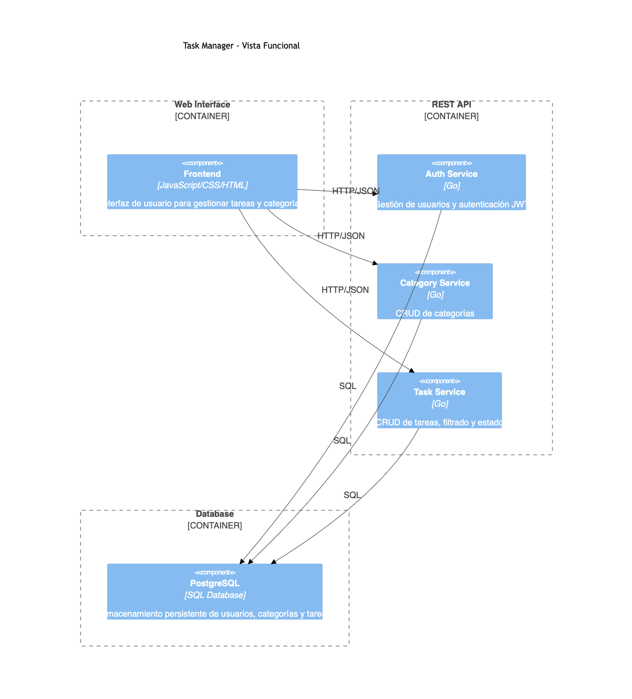

# Task Management App

## Introducción

La aplicación Task Management es una plataforma web que permite a los usuarios crear, organizar y hacer seguimiento de sus tareas diarias. Ofrece funcionalidades de gestión de usuarios, categorías y tareas, permitiendo una experiencia completa para la administración personal de pendientes y actividades.

### Características principales
- **Gestión de usuarios:** Registro, inicio de sesión, carga de imagen de perfil (opcional) y asignación de avatar por defecto.
- **Gestión de categorías:** Crear, ver, actualizar y eliminar categorías para organizar las tareas.
- **Gestión de tareas:** Crear tareas asociadas a categorías, ver y filtrar tareas por categoría y estado, actualizar detalles de tareas (descripción, estado, fecha tentativa de finalización) y eliminar tareas.

## Arquitectura


La arquitectura de la aplicación está compuesta por tres componentes principales:

1. **REST API (Golang):** Encargada de la lógica de negocio y la gestión de peticiones HTTP.
2. **Base de datos (PostgreSQL):** Almacena la información de usuarios, categorías y tareas.
3. **Interfaz web (HTML, CSS, JavaScript):** Permite la interacción del usuario con la aplicación de manera amigable.

El flujo general es el siguiente:
- El usuario interactúa con la interfaz web.
- Las acciones del usuario generan peticiones HTTP a la API REST.
- La API procesa la lógica de negocio y consulta o actualiza la base de datos según corresponda.
- La respuesta es enviada de vuelta a la interfaz web para su visualización.


## Estructura del Repositorio

```
├── go.mod                # Dependencias y configuración del módulo Go
├── main.go               # Código fuente del backend (API REST en Golang)
├── schema.sql            # Script de creación de la base de datos PostgreSQL
├── index.html            # Página principal de la interfaz web
├── style.css             # Estilos de la interfaz web
├── script.js             # Lógica de la interfaz web (JavaScript)
├── README.md             # Documentación del proyecto
```

## Uso

### Requisitos
- Docker y Docker Compose instalados (configuración por definir en el futuro)
- PostgreSQL
- Go 1.22+

### Despliegue local

1. Clona el repositorio:
   ```bash
   git clone <repo-url>
   cd todo_app
   ```
2. Configura las variables de entorno en un archivo `.env` con los datos de conexión a PostgreSQL:
   ```env
   DB_HOST=localhost
   DB_PORT=5432
   DB_USER=postgres
   DB_PASSWORD=tu_password
   DB_NAME=taskdb
   ```
3. Crea la base de datos y las tablas ejecutando el script `schema.sql` en tu instancia de PostgreSQL.
4. Instala las dependencias de Go:
   ```bash
   go mod tidy
   ```
5. Ejecuta el backend:
   ```bash
   go run main.go
   ```
6. Abre `index.html` en tu navegador para acceder a la interfaz web.

> **Nota:** En el futuro se añadirá un `Dockerfile` y/o `docker-compose.yml` para facilitar el despliegue.

---